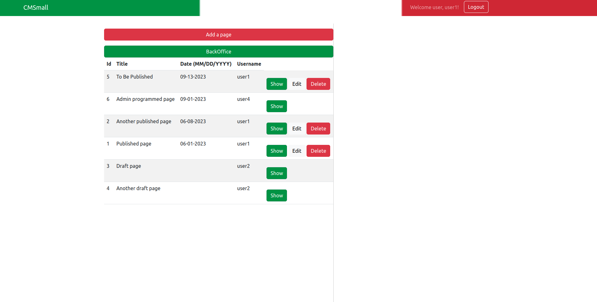
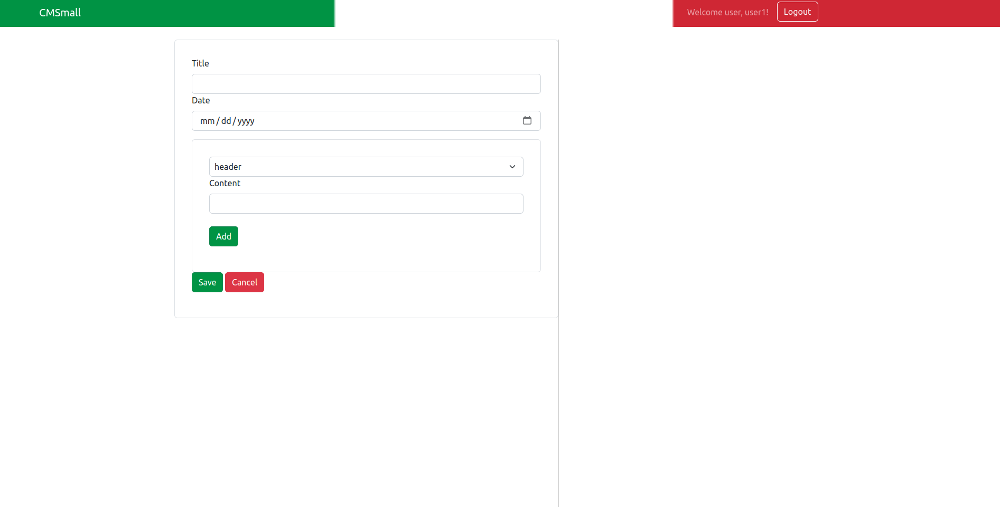

[](https://classroom.github.com/a/_XpznRuT)
# Exam #1: "CMSmall"

## Student: s309530 CELLAMARE FRANCESCO PIO 

# Server side

## API Server

___
### Authentication
- POST `/api/sessions`
  - request body content
  ```
  {
    "username": "user1@email.com",
    "password": "password"
  }
  ```
  - response body content:
  ```
  {
    "username": "user1",
    "email": "user1@email.com",
    "role": 0
  }
  ```

- GET `/api/sessions/current`
  - request parameters and body content: NONE
  - response body content:
  ```
  {
    "username": "user1",
    "email": "user1@email.com",
    "role": 0
  }
  ```


- GET `/api/users` [_only admin_]
  - request parameters and body content: NONE
  - response body content:
  ```
  [
    { "username": "user1" },
    { "username": "user2" },
    { "username": "user3" }
  ]
  ```

- DELETE `/api/sessions/current`
  - request parameters and body content: NONE
  - response body content: NONE

___

### Pages
- GET `/api/pages/` [_only authenticated BACK OFFICE_]
  - request parameters and body content: NONE
  - response body content: 
  ```
  {
    pages: [
      { only page information (no blocks) },
      { ... }
    ]
  }
  ```

- GET `/api/pages/all` [_FRONT OFFICE_]
  - request parameters and body content: NONE
  - response body content: 
  ```
  {
    pages: [
      { only page information (no blocks) },
      { ... }
    ]
  }
  ```

- GET `/api/pages/:pageid/all` [_FRONT OFFICE_]
  - request parameters: pageid
  - request body: NONE
  - response body content: 
  ```
    {
      blocks: [
        {
          blockid: 1
          type: 'header',
          content: 'HEADER',
          rank: 1
          ...
        }
      ]
    }
  ```

- GET `/api/pages/:pageid/` [_BACK OFFICE_]
  - request parameters: pageid
  - request body: NONE
  - response body content: 
  ```
    {
      blocks: [
        {
          blockid: 1
          type: 'header',
          content: 'HEADER',
          rank: 1
          ...
        }
      ]
    }
  ```

- POST `/api/pages` [_only authenticated_]
  - request parameters: NONE
  - request body: 
  ```
    {
      page: {
        title: 'FIRST',
        publishDate: '01/01/1900'
      },
      blocks: [
        {
          type: 'header',
          content: 'HEADER',
          rank: 1,
          ...
        }
      ]
    }
   ```
  - response body: message

- POST `/api/pages/:pageid/block` [_only authenticated and owner (or admin)_]
  - request parameters: pageid
  - request body: 
  ```
    {
      block: {
          type: 'header',
          content: 'HEADER',
          rank: 1,
          ...
        }
      
    }
   ```
  - response body: message

- PUT `/api/pages/:pageid` [_only authenticated and owner (or admin)_]
  - request parameters: pageid
  - request body:
  ```
    {
      title: 'new Title',
      publishDate: '01/01/2023',
      authorId: 'newUser'
    }
  ```
  - response body: NONE
  
 
- PUT `/api/pages/:pageid/:blockid` [_only authenticated and owner (or admin)_]
  - request parameters: pageid and blockid
  - request body:
  ```
    {
      // no type or rank
      content: 'HEADER'
    }
  ```
  - response body: NONE

- DELETE `/api/pages/:pageid` [_only authenticated and owner (or admin)_]
  - request parameters: pageid and blockid

- DELETE `/api/pages/:pageid/:blockid` [_only authenticated and owner (or admin)_]
  delete a block
  - request parameters pageid, blockid
  - request body: NONE
  - response body: NONE

- PUT `/api/pages/:pageid/:blockid/move` [_only authenticated and owner (or admin)_]
    {
      move: 'up' || 'down'
    }
___
### Website name

- GET `api/nameofthewebsite`
  - request parameters: NONE
  - request body: NONE
  - response body: 
  ```
  {
    name: 'CMSmall'
  }
  ```

- POST `api/nameofthewebsite`
  - request parameters: NONE
  - request body
  ```
  {
    name: 'newName'
  }
  ```
  - response body: NONE 
___
## Database Tables

- Table `users` - contains users' information 
  ```
  (username, email, password, salt, role [1 | 0])
  ```
- Table `pages` - show the list of blocks for each page 
  ```
  (pageid, title, creationDate, publishDate, username)
  ```
- Table `blocks` - contains block's information 
  ```
  (blockid, type, content, rank, pageid, username)
  ```
- Table `webname` - contains website name
  ```
  (id, name)
  ```

# Client side


## React Client Application Routes

- Route `/`: Contains front office for the not logged in users and also the back office for the logged in ones. There are forms for creating/editing a page/block and deleting or moving as well
- Route `/login`: Contains login form

## Main React Components

- `LoginForm` (in `Auth.jsx`)
- `Navbar` (in `Navigation.jsx`)
- `PageTable` (in `Page.jsx`): table for all the pages
- `PageBlock` (in `Page.jsx`): table for all the blocks
- `AddPageForm` (in `Form.jsx`): create a page and list of blocks
- `EditBlockForm` (in `Form.jsx`): edit a block (add, edit, move, delete)


# Usage info

## Example Screenshot




## Users Credentials

- user1@email.com, password
- user2@email.com, password
- user3@email.com, password (ADMIN)
- admin@email.com, password (ADMIN)
